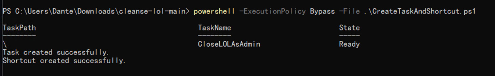
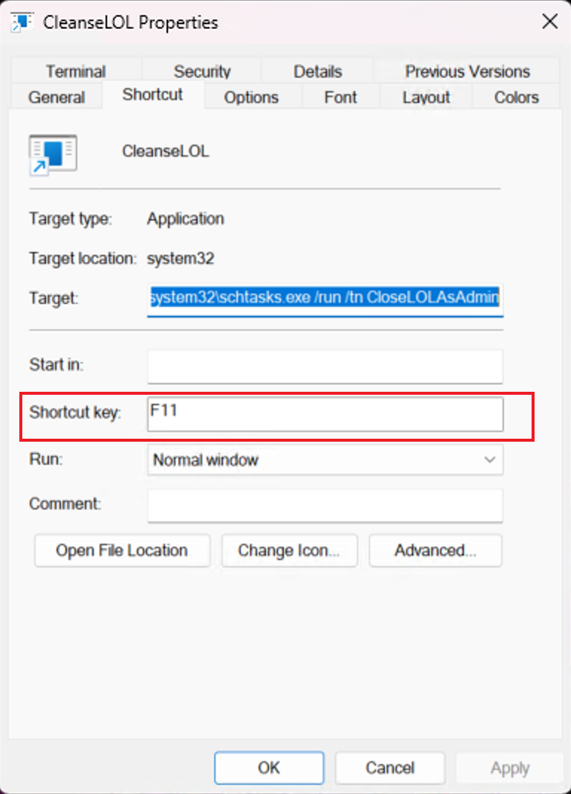

# Cleanse LOL

Close the [League of Legends](https://en.wikipedia.org/wiki/League_of_Legends)(alias as `LOL`) Program quickly, so I don't need to watch the execution animations because losing the game, special for the mode `Teamfight Tactics`(alias as `TFT`)

## Why

I want to enjoy the competition of the game instead of BULL SH*T execution animations.

## Feature

- Use Hotkey `F11` to close `LOL`, and you could use other key by yourself.
- Without any third-part dependancies.
- Quick
- Only for Windows version > 7

## Usage

1. Use `Ctrl + Tab` to go to the desktop.
2. Click the hotkey `F11`

`Cleanse`! That's it. :p

## Install

1. Clone the project to the location you want to store.
2. Open the `powershell` with administrator permission, then jump in the project directory where you cloned before, such as `cd C:\Users\UserName\OneDrive\Desktop\cleanse-lol`.
3. Run the command `powershell -ExecutionPolicy Bypass -File .\CreateTaskAndShortcut.ps1` in the `powershell` terminal.

If you see the result like this, you could find the shortcut which named `CleanseLOL.lnk` on your desktop.

By the way, you could double click `CleanseLOL.lnk` to close `LOL` as well.

## Uninstall

1. Use `Start` search for `Task Scheduler`, then open it.
2. Find the Task named `CloseLOLAsAdmin` and right click to show the menu, then select `delete`, like below:

3. Remove the desktop shortcut `CleanseLOL.lnk`

All Done!

## Customize

### Hotkey

You could change the hotkey by modifing `CleanseLOL.lnk` property like below.

## Disclaimer

The Project is provided "as-is," without any warranties or guarantees of any kind, either express or implied, including but not limited to the implied warranties of merchantability, fitness for a particular purpose, or non-infringement.

In no event shall the contributors of the project be liable for any direct, indirect, incidental, special, consequential, or punitive damages arising out of or related to the use of the Project, even if we have been advised of the possibility of such damages. This includes, but is not limited to, damages for loss of profits, goodwill, use, data, or other intangible losses.

Users of the Project are responsible for their own use of the software and any consequences that may arise from such use. It is the responsibility of the user to ensure that the software is suitable for their needs and to comply with any applicable laws and regulations.